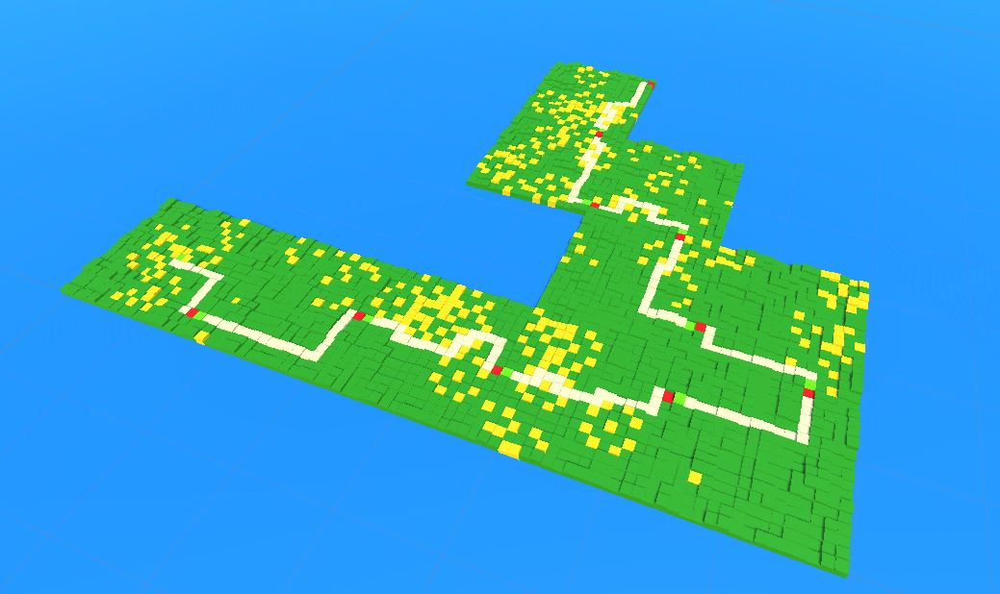

# Procedural-Tower-Defense-Path
A infinite voxel path that is procedural generated in Unity.  

## Description
This program generates a procedural path by using different chunks that connect to each other. Each chunk has obstacles that causes the path to be less straight. The height of tiles in the chunk are generated using Perlin Noise.

## Usage
1. Load into Unity
2. Hit Play

## Technologies Used
C#

## Improvements
 - Refactor code.
 - Change BFS to A*.
 - Add multiple paths.
 - Add more flexibility in the editor or from outside scripts when generating the map.

## License

This project is licensed under the  MIT License - see the LICENSE file for details.
